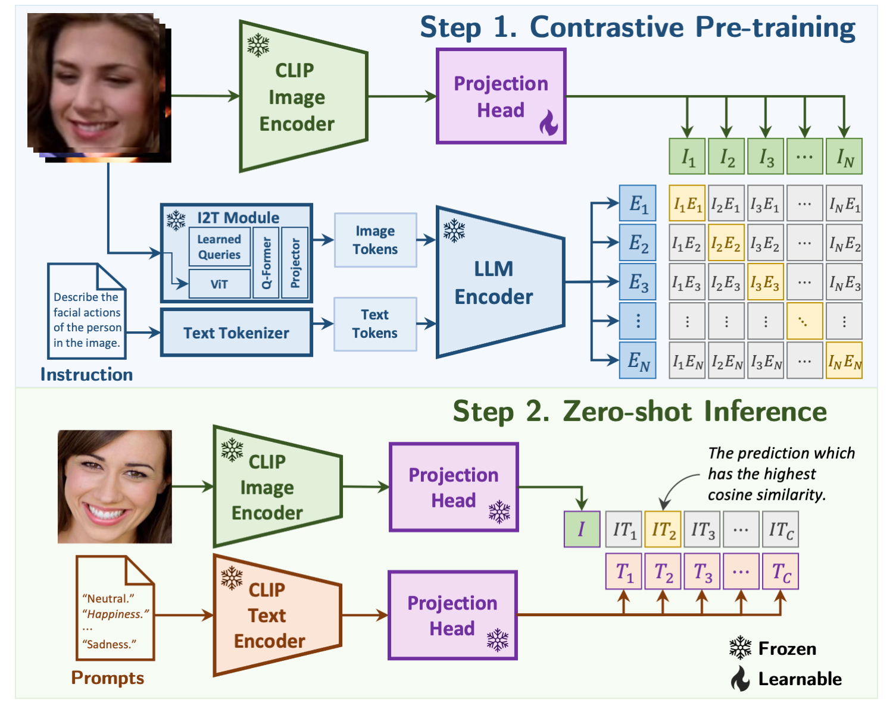
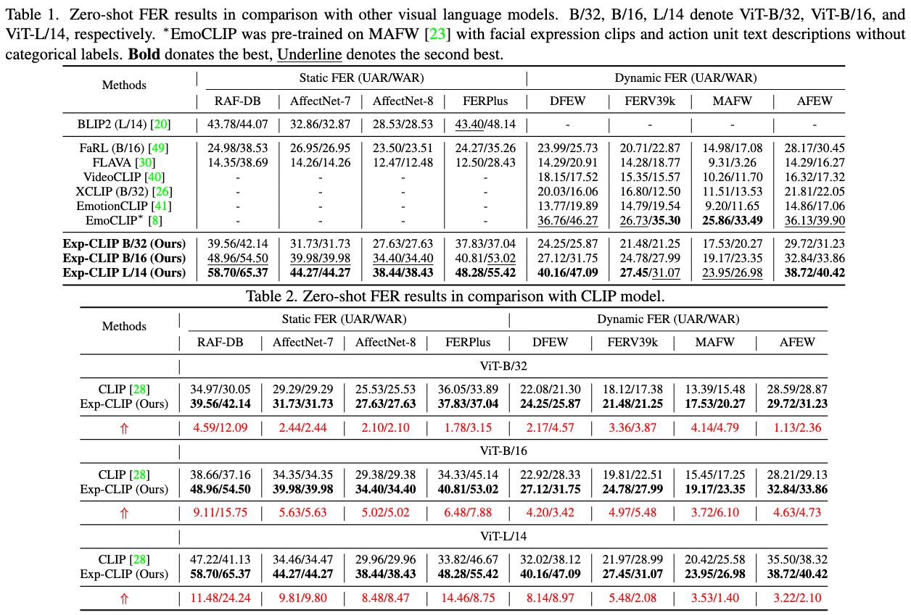

# Enhancing Zero-Shot Facial Expression Recognition by LLM Knowledge Transfer

<p align="center">
    
</p>

This is a PyTorch implementation of the paper:

*Zengqun Zhao, Yu Cao, Shaogang Gong, and Ioannis Patras. "[Enhancing Zero-Shot Facial Expression Recognition by LLM Knowledge Transfer](https://arxiv.org/abs/2405.19100)", IEEE/CVF Winter Conference on Applications of Computer Vision (WACV), 2025. (Oral Presentation)*

### Abstract

Current facial expression recognition (FER) models are often designed in a supervised learning manner thus are constrained by the lack of large-scale facial expression images with high-quality annotations. Consequently, these models often fail to generalize well, performing poorly on unseen images in inference. Vision-language-based zero-shot models demonstrate a promising potential for addressing such challenges. However, these models lack task-specific knowledge therefore are not optimized for the nuances of recognizing facial expressions. To bridge this gap, this work proposes a novel method, Exp-CLIP, to enhance zero-shot FER by transferring the task knowledge from large language models (LLMs). Specifically, based on the pre-trained vision-language encoders, we incorporate a projection head designed to map the initial joint vision-language space into a space that captures representations of facial actions. To train this projection head for subsequent zero-shot predictions, we propose to align the projected visual representations with task-specific semantic meanings derived from the LLM encoder, and the text instruction-based strategy is employed to customize the LLM knowledge. Given unlabelled facial data and efficient training of the projection head, Exp-CLIP achieves superior zero-shot results to the CLIP models and several other large vision-language models (LVLMs) on seven in-the-wild FER datasets.

## Set-Up

Required packages: ``pip install -r requirements.txt``

Modify **train.py**: ``train_data_file_path = 'change to yours'``

Modify **test.py**: ``DATASET_PATH_MAPPING = {change to yours}``

Extra setup for the txt files in **./annotation/**: Please check [preprocessing](https://github.com/zengqunzhao/DFER-CLIP/tree/main/annotation).

## Training

``sh runner.sh``

## Pre-trained Models

The pre-trained projection head are available in ``./checkpoint``

## Performance

<p align="center">
    
</p>

UAR: Unweighted Average Recall (the accuracy per class divided by the number of classes without considering the number of
instances per class);
WAR: Weighted Average Recall (accuracy)

## Citation

If you find our work useful, please consider citing our paper:

```
@InProceedings{Zhao_2025_WACV,
    author    = {Zhao, Zengqun and Cao, Yu and Gong, Shaogang and Patras, Ioannis},
    title     = {Enhancing Zero-Shot Facial Expression Recognition by LLM Knowledge Transfer},
    booktitle = {Proceedings of the Winter Conference on Applications of Computer Vision (WACV)},
    month     = {February},
    year      = {2025},
    pages     = {815-824}
}
```
